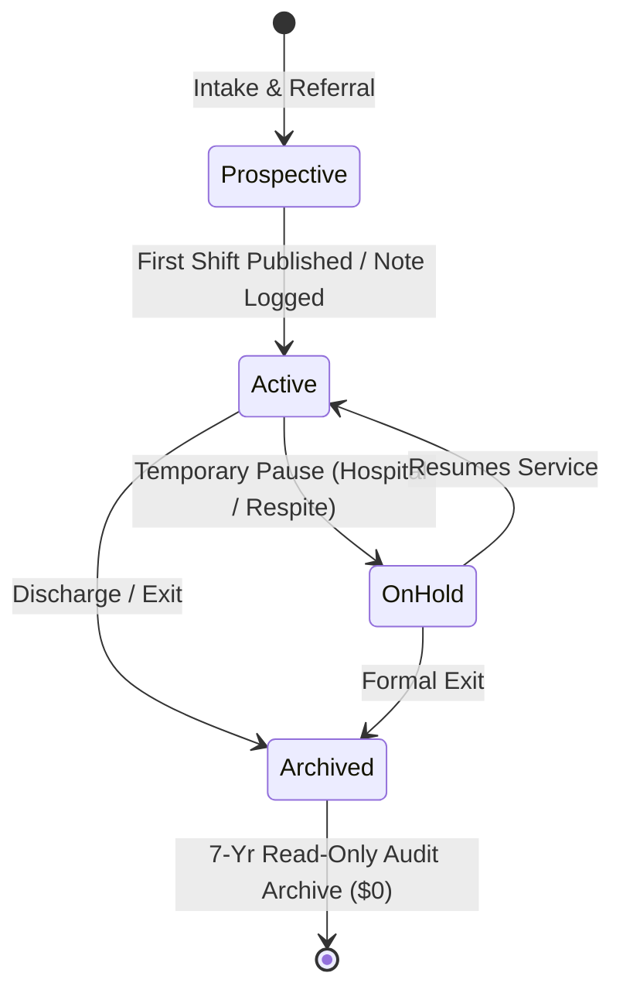
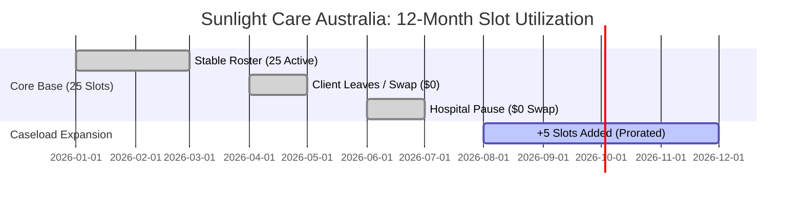

# Kinly CarePro: Complete NDIS Participant Pricing Guide (Annual & Monthly)

A detailed operational and financial guide explaining how **Kinly CarePro's Per-Participant Pricing Model** manages real-world NDIS participant onboarding, discharges, pauses, and caseload growth with zero penalties across both **Annual Upfront Contracts** and **Monthly Subscriptions**.

---

## 1. Executive Summary & Core Philosophy

In the disability sector, participant caseloads are dynamic. Providers experience natural turnover from plan changes, hospitalizations, SIL transitions, and new intakes throughout the year.

Traditional SaaS models penalize providers with rigid contracts:
* **Legacy Per-User Software (e.g., ShiftCare):** Forces providers to pay every time they hire casual support workers, even if participant count remains static.
* **Rigid Per-Client Software:** Charges for departed clients or forces providers to double-pay when a replacement client onboards mid-cycle.

**Kinly CarePro’s Pricing Philosophy** decouples billing from named individuals and eliminates user-based penalties:
1. **Unlimited Staff Accounts ($0):** Roster unlimited support workers, coordinators, team leaders, and finance admins at no extra cost.
2. **Annual Floating Active Slots (\$22/mo):** Providers buy reusable capacity slots; departed clients free up slots immediately for new intakes.
3. **Monthly Fair-Proration Subscriptions (\$25/mo):** Providers pay monthly with automated, day-accurate credits for departed clients and prorated additions for new intakes.

---

## 2. Defining the Participant Status Lifecycle

To ensure mathematical precision and complete transparency, every participant profile in Kinly CarePro exists in one of four clear states:



| Status | Trigger Criteria | Consumes a Paid Slot? | Notes & Permissions |
| :--- | :--- | :---: | :--- |
| **Active** | Participant has at least 1 rostered shift, logged progress note, or active billing run in the cycle. | **YES** | Full access to mobile rostering, GPS visits, Guardian AI, and NDIA billing. |
| **Prospective / Intake** | Participant profile created for service agreement drafting, NDIS plan document upload, and quote creation. | **NO ($0)** | Allows intake teams to prepare profiles without triggering billing. |
| **On Hold (Paused)** | Temporary suspension (e.g., hospital admission, holiday abroad, NDIA funding review pause > 30 days). | **NO ($0)** | Shifts blocked; profile remains editable. Releases the slot for temporary respite clients. |
| **Archived / Discharged** | Participant formally exits the provider's service. | **NO ($0)** | **Slot instantly frees up.** Profile becomes read-only with 100% data access for 7-year NDIS audit retention. |

---

## 3. Annual Plan: "Floating Active Slots" (\$22 AUD / mo)

Under the Annual Plan, providers purchase a pool of **reusable capacity slots** billed upfront (e.g., 25 slots at \$22/mo billed annually = \$6,600/year, saving 12%).

```
┌────────────────────────────────────────────────────────────────────────┐
│                   ANNUAL POOL: 25 ACTIVE SLOTS                         │
├────────────────────────────────────────────────────────────────────────┤
│  [Slot 01: Marcus W.]    [Slot 02: Sarah T.]     [Slot 03: Liam D.]    │
│  [Slot 04: Maya S.]      [Slot 05: James K.]     [Slot 06: Priya N.]   │
│  ...                                                                   │
│  [Slot 24: Elena R.]     [Slot 25: (VACANT - Available for intake)]    │
└────────────────────────────────────────────────────────────────────────┘
       ▲                                                    │
       │                                                    ▼
Participant Leaves ───► Slot Frees Up ($0) ───► New Intake Assigned
```

### 12-Month Real-World Case Study: "Sunlight Care Australia"
* **Provider:** Sunlight Care Australia (SIL & Community Access)
* **Contract:** 25 Annual Slots @ \$22/mo = **\$6,600 AUD**



#### Month-by-Month Events:
1. **Q1 (Jan–Mar):** 25 participants active. Slots used: 25/25. Cost: **\$0**.
2. **Q2 (Apr–May):** *David L.* relocates interstate on April 10 → coordinator clicks "Archive" → slot drops to 24/25. On May 02, *Hannah B.* completes intake and takes the vacant slot (25/25). Cost: **\$0**.
3. **Q3 (Jun–Jul):** *Robert M.* hospitalized for 6 weeks → toggled to "On-Hold" (24/25). *Chloe K.* onboards for 4 weeks of respite (25/25). In July, Robert returns and Chloe exits. Cost: **\$0**.
4. **Q4 (Aug–Dec):** Sunlight Care wins a tender and adds 5 new SIL participants. Coordinator adds 5 slots for the remaining 5 months ($5 \text{ slots} \times \$22/\text{mo} \times 5 \text{ months} = \mathbf{\$550\text{ AUD}}$).

#### Annual Result:
Sunlight Care supported **32 unique individuals** during the year and paid only **\$7,150 AUD** (their peak capacity of 30 slots), saving thousands compared to per-seat models.

---

## 4. Monthly Plan: "Prepaid Base + Fair Proration Adjustments" (\$25 AUD / mo)

For providers who prefer monthly cash flow without annual commitments, Kinly CarePro offers a **Month-to-Month Plan** at **\$25 AUD / active participant / month** with zero lock-in.

### How Monthly Fair Billing Operates (Slack-Style Proration)
1. **Prepaid Base on Cycle Day 1:** The provider pays for their current active participant count at the start of each 30-day cycle.
2. **Day-Accurate Mid-Month Credits:** When a participant is discharged or paused mid-month, the system automatically calculates a **credit for unspent days**.
3. **Day-Accurate Mid-Month Prorated Additions:** When a new participant receives their first shift mid-month, the system calculates a **pro-rata charge for remaining days**.
4. **Consolidated Auto-Settlement on Next Invoice:** On Day 1 of the next cycle, the new monthly invoice automatically subtracts unspent credits and adds prorated additions.

```
┌────────────────────────────────────────────────────────────────────────┐
│                   MONTHLY FAIR PRORATION CYCLE (30 DAYS)               │
├────────────────────────────────────────────────────────────────────────┤
│ Day 01: Initial charge for 20 active participants: 20 × $25 = $500.00   │
│                                                                        │
│ Day 12: Participant A leaves (18 days remaining): Credit = -$15.00     │
│ Day 18: Participant B joins (12 days remaining): Charge = +$10.00      │
│                                                                        │
│ Day 30: Month 2 Invoice Generated:                                     │
│         • Base for 20 active participants:           $500.00           │
│         • Net Mid-Month Adjustment ($10.00 - $15.00): -$5.00           │
│         ──────────────────────────────────────────────────────         │
│         TOTAL MONTH 2 AUTO-CHARGE:                   $495.00           │
└────────────────────────────────────────────────────────────────────────┘
```

---

### Step-by-Step Mathematical Example (Monthly Plan)

Consider **Beacon Support Services** on the Monthly Plan ($25/participant/month, cycle starts on the 1st of each month).

#### Month 1 (June):
* **June 01:** Beacon has **20 active participants**.
  * **Initial Charge:** $20 \times \$25 = \mathbf{\$500.00\text{ AUD}}$.
* **June 12 (Day 12 of 30):** Participant *Marcus T.* moves to another city and is archived.
  * Marcus was active for 12 days; 18 days remained unspent.
  * **Unspent Credit Generated:** $\frac{18\text{ days}}{30\text{ days}} \times \$25 = \mathbf{-\$15.00\text{ AUD}}$ (added to Beacon's Stripe balance).
* **June 18 (Day 18 of 30):** New participant *Aisha K.* finishes intake and begins shifts.
  * Aisha receives service for the remaining 12 days of June.
  * **Prorated Addition Recorded:** $\frac{12\text{ days}}{30\text{ days}} \times \$25 = \mathbf{+\$10.00\text{ AUD}}$.
* **June 30:** Active participant count heading into July is **20 active participants**.

#### Month 2 Invoice (July 01):
$$\text{Base Charge for 20 Active Participants} = \$500.00$$
$$\text{Unspent Credit from Marcus T. (18 days)} = -\$15.00$$
$$\text{Prorated Charge from Aisha K. (12 days)} = +\$10.00$$
$$\mathbf{\text{Total July 01 Charge}} = \$500.00 - \$15.00 + \$10.00 = \mathbf{\$495.00\text{ AUD}}$$

> **Why providers love this:** Providers never lose money when participants leave early, and they never get surprise catch-up bills at the end of the year.

---

## 5. Side-by-Side Comparison: Annual vs. Monthly vs. Competitors

| Feature / Scenario | Kinly CarePro (Annual Plan) | Kinly CarePro (Monthly Plan) | ShiftCare (Per-User Model) | Legacy Enterprise (Per-Client) |
| :--- | :---: | :---: | :---: | :---: |
| **Pricing Rate** | **\$22 AUD** / active slot / mo | **\$25 AUD** / active part. / mo | \$8–\$12 / staff user / mo | \$35–\$50 / client / mo |
| **Billing Frequency** | Billed Annually (Save 12%) | Billed Monthly (Cancel anytime) | Billed Monthly or Annually | Strict 2-3 Year Lock-in |
| **Participant Leaves Mid-Cycle** | **Slot freed instantly for $0 swap** | **Day-accurate credit applied** | Free (charges on carers instead) | ❌ Must pay for departed client |
| **New Participant Onboarding** | Reuses vacant slot for **\$0** | **Prorated for remaining days** | Free (unless extra staff needed) | ❌ Full seat fee charged |
| **Staff & Carer Headcount** | **Unlimited Free Staff Accounts** | **Unlimited Free Staff Accounts** | ❌ Multiplied per casual/relief staff | Free |
| **Hospital / Respite Pauses** | **Toggled to On-Hold ($0)** | **Paused with prorated credit** | Not applicable | ❌ Full fee charged while in hospital |
| **Archived Client 7-Year History** | **100% Free Audit Vault** | **100% Free Audit Vault** | Basic retention | ❌ Archive storage fees |

---

## 6. Edge Cases & Safety Policies (Both Plans)

### Policy A: The "Zero Service Disruption" Soft-Cap
* If a provider with 20 slots/participants suddenly publishes shifts for a 21st participant:
  * Kinly CarePro **never blocks frontline care, shifts, or mobile clock-ins in real time**.
  * The admin dashboard displays: *"1 temporary overage slot in use."*
  * The provider has a **7-day grace window** to either archive an inactive client or confirm a 1-click slot upgrade.

### Policy B: "No Dead Money" Guarantee for Net Caseload Drops (Annual Plans)
* If an annual subscriber experiences a net caseload drop over their final quarter, the pro-rata value of unused slot-months is credited toward their next annual renewal invoice.

### Policy C: 7-Year NDIS Commission Audit Vault
* Archived participant records are preserved in immutable Sydney AWS (`ap-southeast-2`) storage for 7 years at **\$0 extra cost**.
* Coordinators retain instant search, PDF report generation, and CSV export capabilities for any past audit or NDIA claim review.

---

## 7. In-App Subscription Dashboard UI Mockup

```
┌────────────────────────────────────────────────────────────────────────┐
│  KINLY CAREPRO SUBSCRIPTION & USAGE CENTER                             │
├────────────────────────────────────────────────────────────────────────┤
│  Current Plan: Monthly Flexible ($25/mo)   Next Billing Date: Jul 01   │
│                                                                        │
│  Live Caseload Tracker:                                                │
│  ████████████████████████████████░░░░░░░  20 Active Participants       │
│                                                                        │
│  • 20 Active Profiles (Receiving shifts & Guardian AI QA)              │
│  • 2 On-Hold Profiles (Hospital / Holiday Pause, $0)                   │
│  • 3 Prospective Profiles (Intake & Service Agreement Stage, $0)       │
│  • 18 Archived Profiles (7-Year NDIS Compliance Vault, $0)             │
│                                                                        │
│  Pending Mid-Cycle Adjustments for Next Invoice:                       │
│  ├─ Marcus T. Discharged (Jun 12, 18 days unspent):       -$15.00      │
│  └─ Aisha K. Onboarded (Jun 18, 12 days prorated):        +$10.00      │
│  Estimated Next Invoice (Jul 01):                         $495.00      │
│                                                                        │
│  [ Switch to Annual Plan ($22/mo - Save 12%) ]   [ Manage Roster ]     │
└────────────────────────────────────────────────────────────────────────┘
```

---

## 8. Summary of Provider Sales Value Propositions

1. **"Pay for Care Delivered, Not Staff Turnover":** Hire 50 casual support workers without your software bill increasing by a single cent.
2. **"Fair-Prorated Monthly Flexibility":** If a client leaves on Day 10, unspent days are credited directly to your next month's invoice.
3. **"Floating Slots on Annual Plans":** Swap departed participants with new intakes at \$0 extra charge throughout the year.
4. **"Audit-Safe Forever":** Archived participants cost \$0, but their complete clinical and billing history remains compliant with NDIS Commission standards for 7 years.
