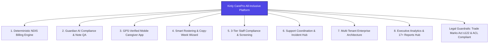
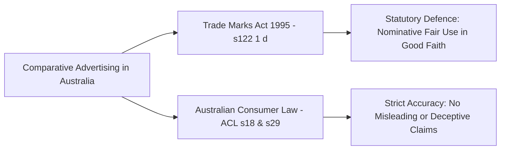

# Kinly CarePro — Standard Launch Marketing Brief & Go-To-Market Blueprint
## Including Legal Framework & Best Practices for Competitor Comparisons in Australia

> **Brand Name:** **Kinly CarePro**  
> **Audience:** Marketing Team, Growth Leads, Legal Counsel, Web Designers, Copywriters  
> **Domain:** NDIS Practice Management Software (PMS) & Care Workforce Automation (Australia)  
> **Pricing Model:** Transparent Participant-Based Pricing ($25 AUD / Active Participant / Month)  
> **Core Value:** **All Features Included for Everyone. Zero Paywalls. Unlimited Staff Accounts.**  
> **Target Benchmark:** ShiftCare, CareMaster, SupportAbility, Lumary

---

## 1. Executive Product Positioning & The "Truth in Code"

### 1.1 Brand Positioning Statement
> **"Kinly CarePro: The All-Inclusive, Audit-Proof NDIS Practice Management Platform — uniting real-time GPS mobile care, deterministic NDIS billing, AI compliance quality assurance, and executive reporting in one high-performance platform."**

While legacy NDIS software (like ShiftCare) locks essential features behind expensive tiered paywalls and penalizes providers by charging per worker, **Kinly CarePro** disrupts the market with **radically transparent pricing**:
- **All Features Included for Everyone:** No "Pro" or "Enterprise" feature gating. Every provider gets the full power of our **Deterministic Billing Engine**, **Guardian AI Note QA**, **Copy-Week Rostering Wizard**, and **17+ Operational Reports Hub** from Day 1.
- **Unlimited Staff & Admin Accounts:** Add 5, 50, or 500 support workers, schedulers, and managers for **$0 extra**.
- **Lucrative Flexible Payment Terms:** Choose between maximum cash flow savings with **Annual Billing (2 Months Free)** or flexible **Monthly Billing**.



---

## 2. Legal Analysis: Competitor Comparisons in Australia (ACCC & Trade Marks)

### 2.1 The Australian Legal Framework

In Australia, **comparative advertising is 100% legal, common, and encouraged by the ACCC** to foster fair competition and inform consumers. However, comparative campaigns must comply with two primary legislative frameworks:



#### 1. Trade Marks Act 1995 (Cth) — Section 122(1)(d)
* **The Law:** Section 122(1)(d) provides an explicit statutory defence: *A person does not infringe a registered trade mark if the person uses the trade mark in good faith for the purposes of comparative advertising.*
* **Application to Kinly CarePro:** You are legally permitted to use the name **"ShiftCare"**, **"CareMaster"**, or **"SupportAbility"** on comparison landing pages (e.g. `/vs/shiftcare`), provided it is done in good faith to inform prospective buyers of feature and pricing differences.

#### 2. Australian Consumer Law (ACL) — Sections 18 & 29 (Enforced by the ACCC)
* **Section 18:** Prohibits conduct in trade or commerce that is *misleading or deceptive, or likely to mislead or deceive*.
* **Section 29:** Prohibits making *false or misleading representations* concerning the price, performance characteristics, uses, or benefits of services.
* **ACCC Test for Comparisons:**
  1. **Compare Like with Like:** You must compare equivalent tiers or clearly state the tier being evaluated (e.g., comparing ShiftCare's base plan vs. Kinly CarePro's all-inclusive plan).
  2. **Substantiation & Truthfulness:** Any claim made about a competitor’s pricing or feature set must be factual, current, and verifiable against publicly available data.
  3. **Overall Consumer Impression:** The overall impression created for a reasonable NDIS provider must be fair, honest, and accurate.

---

### 2.2 The "Do's and Don'ts" Legal Checklist for Kinly CarePro

| Category | ✅ What is 100% Legal & Recommended | ❌ What to Avoid (Legal Risks) |
| :--- | :--- | :--- |
| **Brand Names & Logos** | Use competitor word marks in plain text (e.g., *"ShiftCare"*, *"CareMaster"*). | Do not copy or distort their registered graphic logo/crest without permission (to avoid separate copyright claims). |
| **Pricing Comparisons** | Compare publicly advertised pricing (e.g., *"ShiftCare starts at $8–$15/user/mo, while Kinly CarePro is $25/participant/mo with unlimited users"*). | Do not use outdated pricing; do not hide mandatory competitor fees or misrepresent total costs. |
| **Feature Comparisons** | Compare objective features (e.g., *"Kinly CarePro includes built-in Guardian AI note quality scoring; ShiftCare does not have real-time AI compliance scoring"*). | Do not make disparaging personal attacks on competitor integrity, staff, or financial health (*injurious falsehood*). |
| **Date-Stamping** | Include a clear date stamp: *"Data verified as of August 2026 based on publicly available information."* | Do not present historical competitor data as current if they have recently updated their product. |
| **Mandatory Disclaimer** | Prominently display a standard SaaS legal disclaimer at the bottom of the comparison page. | Never imply that the competitor endorses, sponsors, or is affiliated with Kinly CarePro. |

---

### 2.3 Mandatory Website Legal Disclaimer (Copy & Paste for Web Team)

Every competitor comparison page (e.g., `/vs/shiftcare`) must display this standard disclaimer in the page footer:

```html
<div class="legal-disclaimer text-xs text-gray-500 mt-12 border-t pt-6">
  <p><strong>Disclaimer & Trademark Notice:</strong></p>
  <p>
    All product names, trademarks, logos, and registered trademarks mentioned on this page 
    (including <em>ShiftCare</em>) are the property of their respective owners. Reference to 
    these trademarks is made under nominative fair use for the purpose of comparative advertising 
    in accordance with Section 122(1)(d) of the <em>Trade Marks Act 1995 (Cth)</em>.
  </p>
  <p class="mt-2">
    The information presented on this comparison page is gathered from publicly available sources 
    (including competitor websites, public pricing pages, and marketing materials) as of 
    <strong>August 2026</strong>. Product features, service terms, and pricing are subject to change. 
    Kinly CarePro is an independent software platform and is not affiliated with, endorsed by, or 
    sponsored by ShiftCare or any other third party. We recommend verifying current feature sets and 
    pricing directly on the respective vendor's official website.
  </p>
</div>
```

---

### 2.4 Three High-Converting (and 100% Safe) Comparative Content Strategies

#### Strategy 1: Direct Head-to-Head Comparison Pages (`/vs/shiftcare`)
- **Focus:** Factual, side-by-side table comparing the pricing model (Per-User vs. Per-Participant) and key features (Deterministic Billing, Guardian AI, Copy-Week Wizard).
- **Tone:** Objective, professional, and solutions-oriented.

#### Strategy 2: Conceptual & Educational Category Pages (`/why-participant-pricing`)
- **Focus:** Discuss the broader industry problem without attacking a specific vendor: *"Why Per-User Pricing is Broken for NDIS Providers: The Case for Participant-Based Software"*.
- **Benefit:** Highly shareable on LinkedIn and ranks organically for educational search terms without triggering competitor pushback.

#### Strategy 3: "Switcher Stories" & Verified Case Studies (`/switch-to-kinly`)
- **Focus:** Real quotes from NDIS providers who moved from legacy PMS tools to Kinly CarePro: *"How XYZ Care reduced weekly billing reconciliation from 8 hours to 20 minutes by switching to Kinly CarePro"*.
- **Benefit:** Genuine customer testimonials are protected and represent the highest-converting social proof on SaaS websites.

---

## 3. The "All Features Included" Pricing & Packaging Breakdown

```
┌────────────────────────────────────────────────────────────────────────────────────────┐
│                         KINLY CAREPRO ALL-INCLUSIVE PRICING                            │
│                                                                                        │
│                           $25 AUD / Participant / Month                                │
│                   Minimum $99 AUD / month (Includes up to 4 Participants)              │
│                       Annual Subscription (1-Year Commitment)                          │
├────────────────────────────────────────────────────────────────────────────────────────┤
│  ✅ UNLIMITED Support Worker & Caregiver Accounts ($0 Extra)                          │
│  ✅ UNLIMITED Admin, Scheduler & Manager Accounts ($0 Extra)                          │
│  ✅ 100% Full Access to EVERY Single Platform Feature                                 │
│  ✅ ZERO Feature Paywalls or Hidden Add-on Fees                                        │
└────────────────────────────────────────────────────────────────────────────────────────┘
```

---

## 4. Head-to-Head TCO Battlecard: Kinly CarePro vs. ShiftCare

```
┌────────────────────────────────────────────────────────────────────────────────────────┐
│                   TOTAL COST OF OWNERSHIP (TCO) COMPARATIVE BREAKDOWN                  │
│                     Scenario: 25 Active Participants + 50 Support Workers              │
├───────────────────────────────────────────────────────┬────────────────────────────────┤
│ SHIFTCARE PRICING (Per-User + Tiered Gating)          │ KINLY CAREPRO (Annual Plan)    │
├───────────────────────────────────────────────────────┼────────────────────────────────┤
│ • 50 Support Worker Seats @ $10/user/mo = $500/mo     │ • 25 Participants @ $25/mo     │
│ • 4 Admin / Coordinator Seats @ $15/user/mo = $60/mo  │   = $625 / month               │
│ • Pro tier surcharge to access advanced features      │ • UNLIMITED Worker Accounts ($0│
│ • Extra cost when hiring casual relief staff ($$$)    │ • UNLIMITED Admin Accounts ($0)│
│ • Third-party add-on tools for forms & compliance     │ • ALL FEATURES 100% INCLUDED:  │
│                                                       │   - Deterministic Billing      │
│                                                       │   - Guardian AI Note QA        │
│                                                       │   - Copy-Week Wizard           │
│                                                       │   - 17+ Reports Hub            │
│ TOTAL: $650 – $800+ / month                           │ TOTAL: $625 / month            │
│ ⚠️ Complex tiers, feature paywalls & per-seat taxes!   │ 🏆 1 Simple Price. ALL Features│
└───────────────────────────────────────────────────────┴────────────────────────────────┘
```

---

## 5. Deep-Dive: The 8 Core Value Pillars Backed by Code

---

### 🛡️ PILLAR 1: Deterministic NDIS Billing & Claim Engine (PAPL 2025–26)
* **The Code Implementation:**
  - **`timeSegmentation.js` & `bandSibling.js`:** Pure deterministic time boundary splitting evaluated in the shift's local IANA timezone (`Australia/Sydney`, etc.). Automatically divides shifts at **6:00 AM** (Daytime), **8:00 PM** (Evening), and **12:00 AM** (Night), automatically resolving weekend (`Saturday`, `Sunday`) and state-specific `Public Holiday` rates.
  - **`catalogueMatcher.js`:** Real-time matching against active NDIS Pricing Arrangements and Price Limits (PAPL 2025–26) with validity date checks, support category codes, and automatic high-intensity upgrades.
  - **`ratioCalculator.js`:** Automated per-participant pricing formula: $\text{Rate} = \text{CataloguePriceLimit} \times (\text{Numerator} / \text{Denominator})$ with automatic no-show denominator adjustments.
  - **`travelClaims.js` & `cancellationClaims.js`:** Automatically generates separate `TRAN` claim lines for non-labour travel (per-km) and labour travel time, as well as compliant `CANC` lines with NDIA reason codes (`ZPCA`, `ZOTH`, etc.).
  - **`billingRunService.js` (74KB Engine):** Manages draft vs. committed billing runs, line-item variance audit trails, immutable baseline lines, and 1-click **NDIA Bulk CSV generation** (`BATCH-YYYYMMDD-XX.csv`) and branded PDF invoices.
* **Website Marketing Copy:**
  - **Headline:** *Zero-Rejection NDIS Bulk Billing. 100% Deterministic Accuracy.*
  - **Subheadline:** From completed shift to NDIA Bulk CSV and participant invoice in three clicks. Automatically split evening, night, and weekend rates, calculate group ratios, and claim travel without spreadsheets.

---

### 🤖 PILLAR 2: Guardian AI Compliance & Clinical Quality QA
* **The Code Implementation:**
  - **`complianceController.js` & `llmService.js`:** Built-in LLM-powered Guardian AI analysis engine evaluating progress notes in real time.
  - **Multi-Dimensional Compliance Scoring (0–100):** Evaluates person-centered phrasing, active support documentation, participant engagement, and measurable goal outcomes.
  - **`POST /api/v1/compliance/rewrite`:** Interactive AI rewrite assistant that takes rough frontline notes and restructures them into professional, audit-compliant clinical records.
  - **`invoiceAuditService.js`:** Automated pre-billing audit scanning completed shifts to detect missing documentation before claims are submitted.
* **Website Marketing Copy:**
  - **Headline:** *Turn Frontline Notes into Audit-Proof Documentation with Guardian AI.*
  - **Subheadline:** Guardian AI reviews, scores, and upgrades progress notes in real time — ensuring 100% alignment with participant NDIS goals and Commission standards before billing runs are finalized.

---

### 📱 PILLAR 3: GPS-Verified Mobile Caregiver App (iOS & Android)
* **The Code Implementation:**
  - **`HomeScreen.js` & `LocationScreen.js`:** React Native + Expo native mobile application featuring one-tap GPS Check-In and Check-Out.
  - **`checkInLocationService.js` & `CheckInOut.js`:** Geofence validation matching device GPS coordinates against facility perimeters or participant residential addresses (25m–5000m radius) with live accuracy meters (Green/Amber/Red signal strength).
  - **Offline-First Redux Synchronization (`ActivitySlice.js`):** Support workers can log care activities and progress notes without mobile data; auto-syncs upon reconnection.
  - **14+ Structured Activity Types:** Fast-tap logging for Personal Care, Medication Administration, Meal Prep, Mobility Assistance, Transport, Domestic Assistance, and Social Support.
* **Website Marketing Copy:**
  - **Headline:** *A Fast, Reliable Mobile App Your Support Workers Will Love.*
  - **Subheadline:** Give your frontline team the tools they need to log care effortlessly — with geofenced GPS check-in, offline note entry, and instant shift visibility.

---

### 📅 PILLAR 4: Smart Rostering & The Copy-Week Wizard
* **The Code Implementation:**
  - **`CopyWeekWizardPage.tsx` & `copyWeekWizardUtils.ts`:** Automated batch replication engine that copies an entire week's schedule across multiple staff and participants into future weeks with intelligent conflict checking.
  - **`RosterCalendarPage.tsx` & `RosterSchedulerCanvas.tsx`:** High-performance visual scheduler offering Day, Week, Month, and interactive drag-and-drop Timeline views.
  - **`rosterGenerationService.js` & `assertStaffAssignable`:** Real-time validation against `AvailabilitySlot` records, preventing double-booking and matching unassigned shifts to qualified staff.
  - **`rosterNotificationService.js`:** Automated push notification pipeline alerting staff immediately when shifts are published, modified, or cancelled.
* **Website Marketing Copy:**
  - **Headline:** *Build Complex NDIS Rosters in Seconds, Not Hours.*
  - **Subheadline:** Eliminate repetitive scheduling tasks. Replicate full weekly schedules with the Copy-Week Wizard, drag-and-drop on the Timeline Canvas, and match shifts to available staff instantly.

---

### 🎓 PILLAR 5: Staff Compliance & Worker Screening Governance
* **The Code Implementation:**
  - **`complianceService.js` & `StaffComplianceTab.tsx` (71KB UI):** Multi-tier worker compliance engine:
    - **Tier 1 (Blocking Mandatory):** NDIS Worker Screening Database Check (NDISWC), Working With Children Check (WWCC), Police Check, First Aid, CPR, and Proof of Identity.
    - **Tier 2 (Credentials):** Cert III/IV in Disability/Individual Support, Nursing registrations, Drivers Licence.
    - **Tier 3 (Training Modules):** NDIS Worker Orientation Module (*"Quality, Safety and You"*), Infection Control, Hand Hygiene.
  - **Risk-Assessed Role Enforcement (`isRiskAssessedRole`):** System automatically flags and restricts non-compliant staff from being assigned to high-intensity or direct-care shifts.
  - **`expiryNotificationService.js`:** Proactive automated expiry warning alerts (30/60/90 days).
* **Website Marketing Copy:**
  - **Headline:** *Zero-Compromise Staff Compliance & Credential Tracking.*
  - **Subheadline:** Protect your participants and your registration. Automatically track NDIS Worker Screening, WWCC, First Aid, and training modules with automated expiry alerts and roster blocks.

---

### 🚨 PILLAR 6: Support Coordination & NDIS Incident Management Hub
* **The Code Implementation:**
  - **`CoordinationLogPage.tsx` & `coordinationController.js`:** Dedicated Support Coordination workspace tracking billable coordination periods, milestone delivery, and client funding burn rates.
  - **`IncidentFormPage.tsx` & `incidentController.js`:** Comprehensive NDIS incident workflow categorizing severity (Minor, Moderate, Serious, Reportable) and incident types (Abuse/Neglect, Serious Injury, Death, Restrictive Practices, Sexual Misconduct, Medication Errors).
  - **`incidentReportHtmlService.js`:** Generates formal, branded PDF incident reports formatted for executive review and submission to the NDIS Commission.
  - **`behaviorController.js` & `BehaviorWatchListDialog.tsx`:** ABC (Antecedent, Behavior, Consequence) observation logging, intensity scoring (1–5), and behavioral support monitoring.
* **Website Marketing Copy:**
  - **Headline:** *Dedicated Workspaces for Support Coordinators & Incident Governance.*
  - **Subheadline:** Manage Capacity Building milestones with precision and handle safety incidents with structured, Commission-compliant reporting workflows.

---

### 📊 PILLAR 7: Executive Analytics & 17+ Operational Reports Hub
* **The Code Implementation:**
  - **`reportsExtendedController.js` (91KB Engine) & `ReportHubPage.tsx`:** Comprehensive reporting hub with **17 specialized NDIS reports** organized into 4 executive suites:
    1. **Shift Operations:** Shift Details, Shift Progress (submission-ready service records), Staff Attendance, Check-In History, Roster Variance (punctuality & late start tracking).
    2. **Billing & Financials:** Billing Summary, Billing Line Items, Bulk Claims History, Participant Billing (plan budget utilization), Business Revenue Analysis.
    3. **Workforce & Payroll:** Staff Performance (hours & activity output), Payroll Summary, Payroll Line Items (rate matrix application).
    4. **Compliance & Quality:** Document Expiry Alerts, Location Accuracy & Geofence Adherence, Care Activity Distribution.
  - **Multi-Format Export Engine (`handleFormatResponse`):** 1-Click exports to **Branded PDF** (with provider logo, ABN, NDIS number, and custom hex styling via `pdfExporter.js`), **Excel XLSX** (with pre-built summary formulas via `excelExporter.js`), **CSV**, and **JSON API**.
* **Website Marketing Copy:**
  - **Headline:** *Total Operational Clarity with 17+ Instant NDIS Reports.*
  - **Subheadline:** From audit-ready attendance records to business revenue analytics and roster variance — export branded PDFs, Excel workbooks, and CSVs with one click.

---

### 🏢 PILLAR 8: Multi-Tenant Enterprise Architecture & White-Labeling
* **The Code Implementation:**
  - **`Tenant.js` & `TenantRepository.js`:** Complete multi-tenant data isolation with custom subdomain (`provider.kinlycarepro.com`) and custom domain verification.
  - **Branding Customization (`TenantBrandingPage.tsx`):** Custom logos, favicon, primary/secondary hex color theming, custom login page banners, and custom CSS.
  - **Granular RBAC (`RoleManagement.tsx` & `roleController.js`):** Scoped permissions across Activity Logs, Progress Notes, Staff Management, Care Person details, Billing, and Organization Settings.
  - **`PlatformAdminController.js` & `SystemHealthPage.tsx`:** Super-admin dashboard with tenant health scoring, seat management, and comprehensive immutable audit trails (`AuditLog.js`).
* **Website Marketing Copy:**
  - **Headline:** *Enterprise Security and Custom Branding for Growing Providers.*
  - **Subheadline:** Deploy your own branded care portal with custom domains, dedicated role-based access control, and complete multi-facility data isolation.

---

## 6. Actionable Implementation Checklist for Marketing, Web & Legal Teams

- [ ] **Review Comparison Copy against ACL Guidelines:** Ensure all pricing and feature claims for ShiftCare, CareMaster, and SupportAbility are accurate, verifiable, and date-stamped.
- [ ] **Embed Mandatory Legal Disclaimer:** Ensure the disclaimer from Section 2.3 is included in the footer of `/vs/shiftcare` and all comparison pages.
- [ ] **Use Clean Text Word Marks:** Use plain text *"ShiftCare"* rather than copying vector trademark logos.
- [ ] **Implement Complete Sitemap Navigation:** Build the 8 Feature deep-dives, 3 Solutions pages, and `/vs/shiftcare` comparison page.
- [ ] **Launch the Public NDIS Price Guide Explorer (`/ndis-price-guide`):** Create the searchable directory for PAPL 2025–26 item codes to generate massive organic search traffic.
- [ ] **Deploy Interactive TCO Calculator (`/ndis-software-calculator`):** Highlight instant cost savings vs ShiftCare's per-user model.
- [ ] **Implement Technical SEO Schemas:** Add `SoftwareApplication`, `FAQPage`, and `BreadcrumbList` structured data across all marketing pages.
